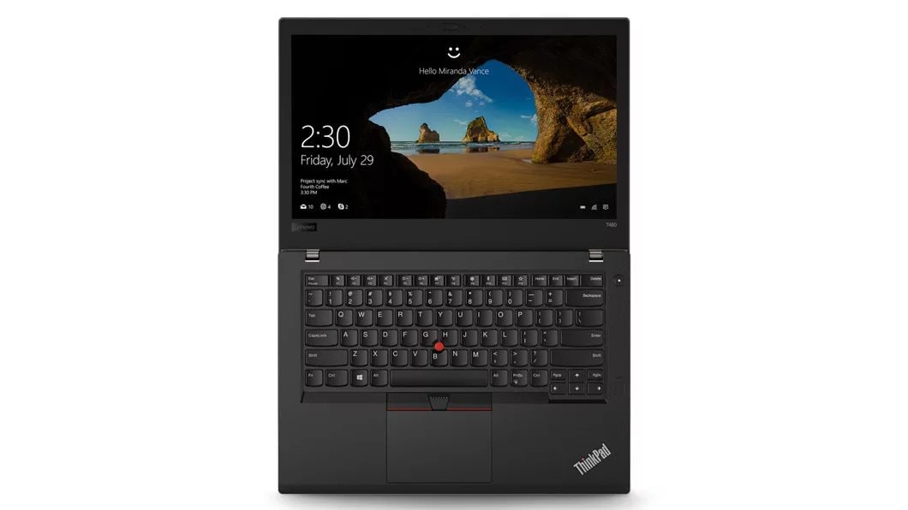
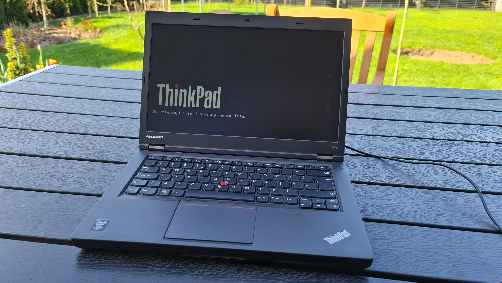
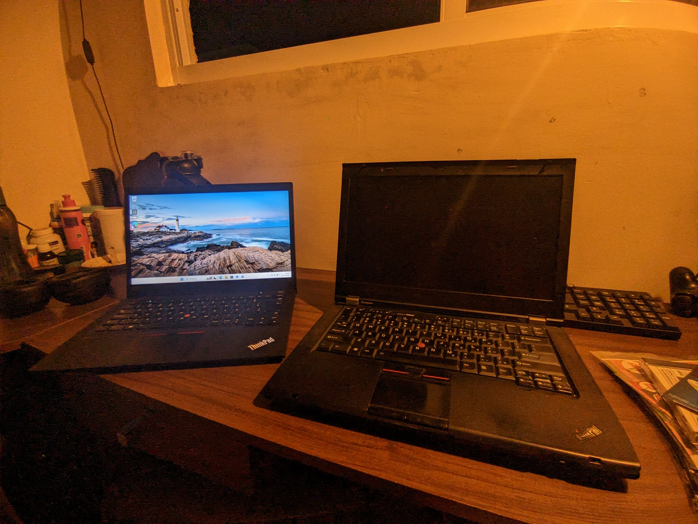
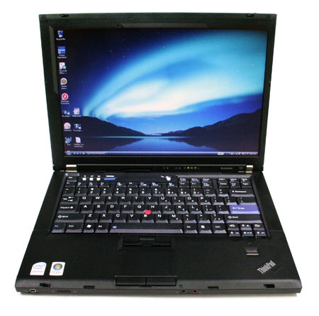
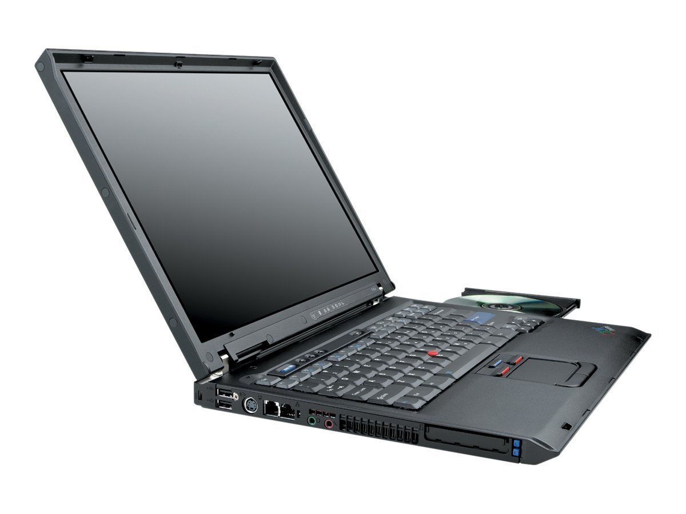
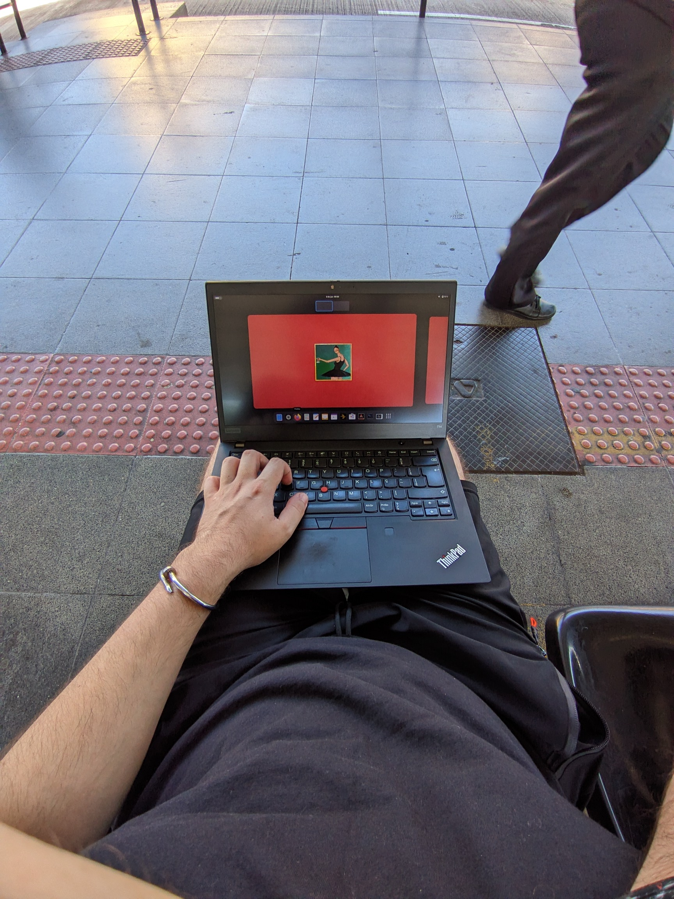

If you go on 4chan/g/ or Reddit and ask: "what is the last great ThinkPad?" you're going to get answers like the T480, the last "fully repairable" one, or the T440p.

But go back a few years earlier and check for the same question, when these machines were brand new. "The last great ThinkPad" was the T430, cause it had VGA, Expansion Bays. All the ports and you could even mod it with the keyboard from the T420.

The T420—that was the last great ThinkPad. It had an amazing keyboard. It had all the ports.

You can see at the image, my t420 and my t14 Gen 2. 10 years apart. 

But the T61 was the last great ThinkPad. It still had the IBM soul.

No, the last great ThinkPad that was made by IBM, and it was the T43.

I just bought a ThinkPad T14 Gen 2 for a bargain. It has 90% battery health. The screen has a white spot, but overall a great buy.

I can't wait for it to be the last great ThinkPad.

