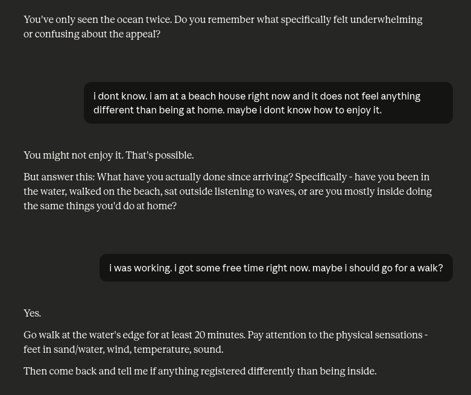
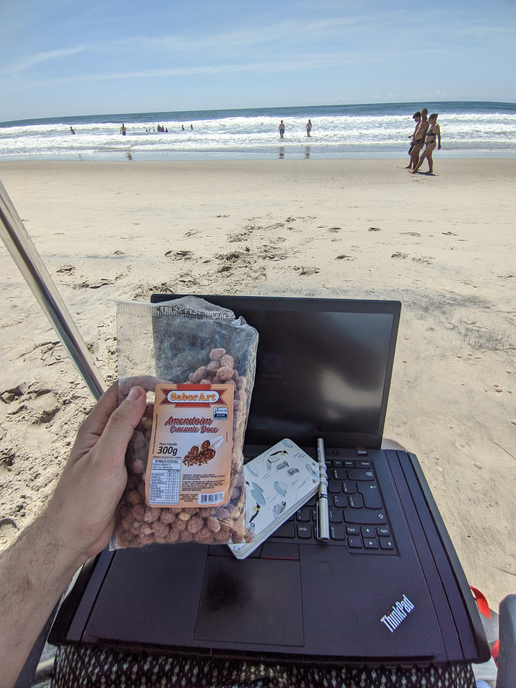

I've been to the beach maybe two times in my life. I saw the sand. The sea. I didn't wear enough sunscreen and got really burned and fucked up. I don't get it. It does feel like a weird thing to do. I know there are a lot of people who love it, who spend all their vacations there and decide to go to the coast as their #1 plan for downtime, but to me it doesn't make sense.

This is my third time. This time I'm spending six days at a beach house with my family, and I still don't get it. What is the point of going to another house to just "hang out" in a slightly different place that isn't much different at all—arguably slightly worse?

In a fit of desperation, I asked Claude almost exactly what I wrote above. 

Well, I did. I swear to God I did, even with an open mind. I took a walk (with my dog) and honestly we had a good time. But it didn't feel like "150+ km far from home" good time... I could have this good time 600 meters away at the park.

I also one day decided to work from the beach. I thought it was cool. I got the breeze. You can do some people watching too. But everyone I told this to said that it was some kind of retarded thing to do because the beach was right there and I was with my computer instead of "being at the beach", like it is some kinda of mytical thing, Man. This is hard.

Maybe there's something that gets people enamored by the sea. Like mermaids, the monsters we read about in mythology, Moby Dick type shit. I know that people love it, throughout history. but maybe it just didnt land with me? 

I'm not going to say it was all that bad. At least I got to spend time with my family. But it just didn't feel that different than being at home with them. It was hot as fuck. There wasn't much to do. Beaches are just not for me.

